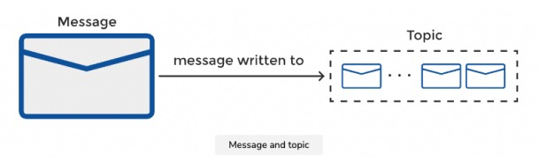
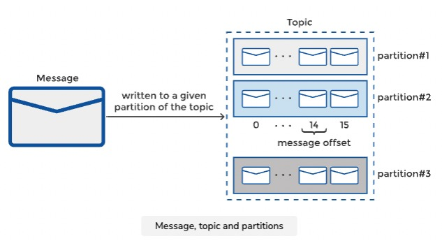

## Introduction
---

> **From Official documentation :** A distributed event streaming platform that lets you read, write, store, and process events (also called records or messages in the documentation) across many machines.

An event is an independent piece of information that needs to be relayed from one point (producer/publisher) to another point (consumer/subscriber)

Kafka is an **intermediary** which moves records from one point to another by decoupling them from each other. This means producer is unaware of consumer and when event is consumed. Pattern allowing decoupling of producers and consumers is called as **Asynchronous Messaging**

It has 2 patterns:

1. Publish - Subscribe (Pub - Sub)
2. Message Queuing

### Publish - Subscribe (Pub - Sub)
In this pattern, participant produces record on to a channel or topic. This record will be consumed by *multiple readers* and records will be delivered in order that they were published.

### Message Queuing
In this pattern, participant produces record on to a channel or topic. This record will be consumed *only once and by one reader* and consumer will acknowledge the consumption, message with be deleted from Queue.

## Components of Kafka
---

### Message 
A message is *unit of data* in Kafka ecosystem and technically an *array of bytes*.

Kafka sends messages in *batch to reduce overhead* that occurs by send individual messages. This leads to tradeoff between latency and throughput.

If batch size is large, throughput is high as more messages are handled per unit of time.

If batch has a single message, latency is high as it took longer to deliver a single message

To improve efficiency in data transfer, batched messages are compressed

Each message has 

**Event:**  type of message represents a fact that happened in past and are immutable.

### Streams
A stream represents events in motion.

### Topic
Topic is a stream of data and is similar to a table in database without constraints. Messages will be written and read from topics. 

Can create any number of topics and each topic will have a unique name

### Partition
A topic is subdivided into logical units known as **partitions**.

- Messages are ordered by time within a partition and not across the topic
- Messages are read from start to end in a partition
- Messages are appended at the end of partition
- Partitions allow Kafka to scale horizontally and provide redundancy.
- Each partition can be hosted on different servers and can scaled to handle load efficiently
- Partiton count will be defined while creating a topic and this value can adjusted later

### Message Key
As topic is subdivided into partitions, messages need to go to same partition to ensure order. We can control it using **Message Key**.

Message Key is technically a byte array and it's optional.

All messages with same key lands in same partition

### Message Offset
Each message has a metadata field called offset. An **offset** is an integer which determines the *order of message* within a partition and is *ever increasing* value.

Consumer group will remeber the offset and starts reading messages from there. 

### Schema
Kafka doesn't mandate that messages conform to any given schema. However, it is recommended that messages follow a structure and form, that allows for easy understanding. Messages can be expressed in JSON, XML, Avro, or other formats. It is important to think about and mitigate issues that arise from schema changes.

*Avro* provides support for schema evolution and allows for backward and forward compatibility.

### Brokers

- A single Kafka server is called a **Broker**
- Several Kafka brokers operate as **Kafka Cluster**
- A broker controls the cluster called as **controller**. It is responsibe for administrative actions like assigning partitions and monitoring for failures. It will be elected from the live members of cluster.
- A partition can be replicated across the assigned brokers to provide availability in case of broker failure.
- **Replication factor** determines the number of replicas for a partition.
- A broker is called as **Leader** and owns the partition among other brokers. All other partition replicating brokers are called **Followers**
- Messages in Kafka are stored durably for a configurable **retention period**
- Broker is responsible for receiving messages and committing them to disk. Similarly, brokers are responsible to respond messages with request from consumers

### Producers 
Producers create messages and are sometimes referred as writers or publishers. Can have custom partitioner for partition assignment of message

### Consumers
Consumers read messages and are sometimes referred as readers or subscribers. They operate in  a group called **consumer group**. Each partition is read by a single member of group, though single member can read from multiple partitions. The mapping of a consumer to a partition is called the **ownership of the partition by the consumer**. If a consumer fails, the remaining consumers in the group will **rebalance** the partitions amongst themselves to make up for the failed member.

