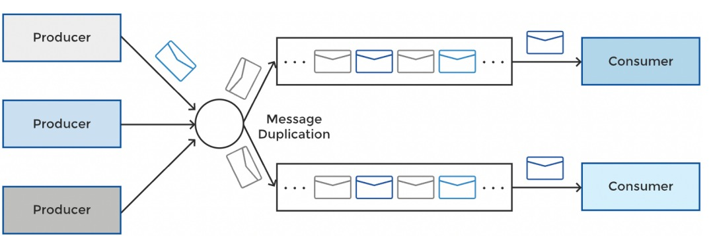
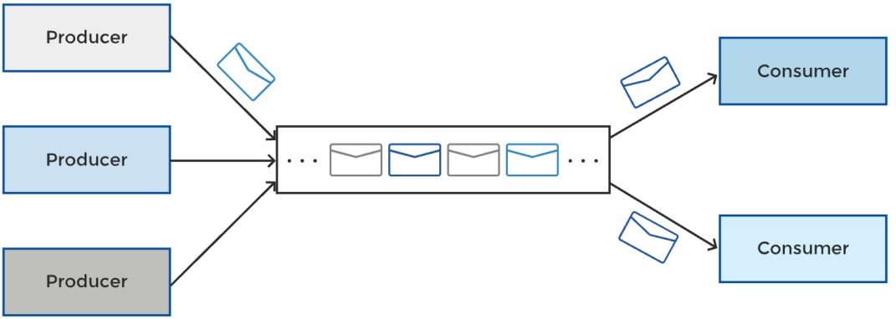

## Introduction
---

> **From Official documentation :** A distributed event streaming platform that lets you read, write, store, and process events (also called records or messages in the documentation) across many machines.

An event is an independent piece of information that needs to be relayed from one point (producer/publisher) to another point (consumer/subscriber)

Kafka is an **intermediary** which moves records from one point to another by decoupling them from each other. This means producer is unaware of consumer and when event is consumed. Pattern allowing decoupling of producers and consumers is called as **Asynchronous Messaging**

It has 2 patterns:

1. Publish - Subscribe (Pub - Sub)
2. Message Queuing

### Publish - Subscribe (Pub - Sub)
In this pattern, participant produces record on to a channel or topic. This record will be consumed by *multiple readers* and records will be delivered in order that they were published.

### Message Queuing
In this pattern, participant produces record on to a channel or topic. This record will be consumed *only once and by one reader* and consumer will acknowledge the consumption, message with be deleted from Queue.

